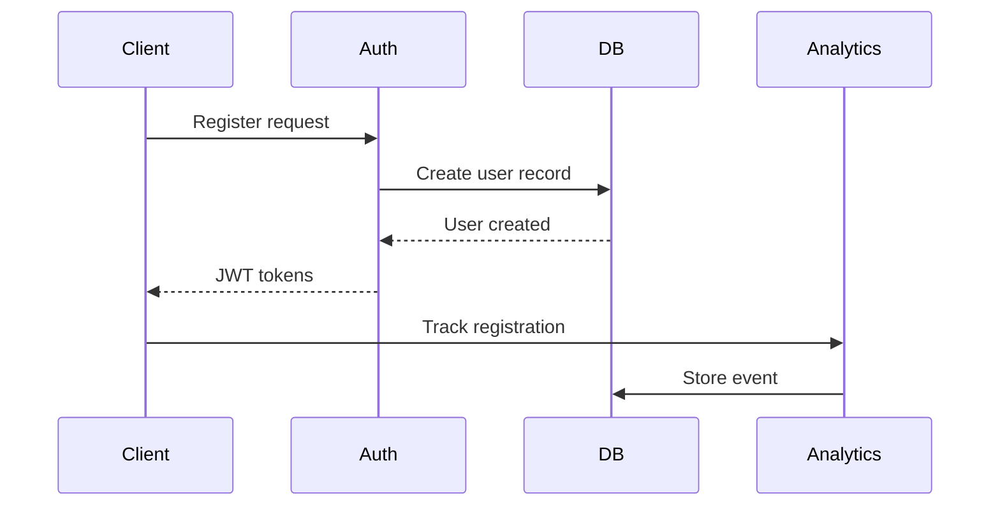
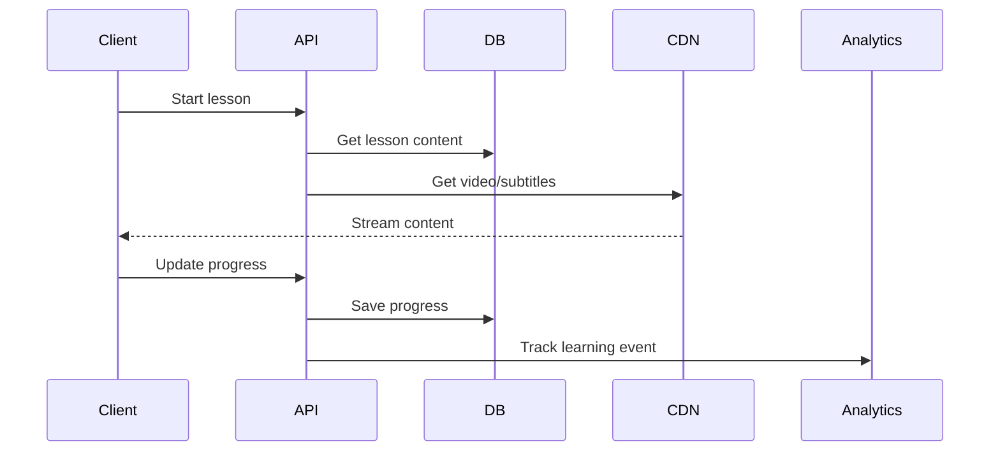
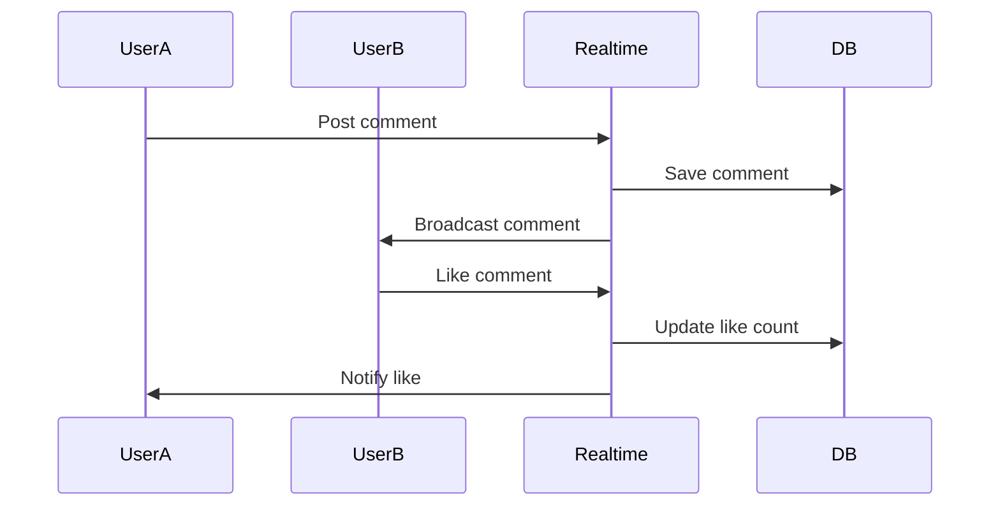

# CineFluent Architecture Overview

This document provides a high-level overview of the CineFluent system architecture, core services, and technology decisions.

## System Architecture

### High-Level Architecture
```
┌─────────────────┐    ┌─────────────────┐    ┌─────────────────┐
│   Mobile Apps   │    │   Web Client    │    │   Admin Panel   │
│  (iOS/Android)  │    │    (React)      │    │    (React)      │
└─────────┬───────┘    └─────────┬───────┘    └─────────┬───────┘
          │                      │                      │
          └──────────────────────┼──────────────────────┘
                                 │
                    ┌─────────────┴─────────────┐
                    │      API Gateway          │
                    │   (Rate Limiting, Auth)   │
                    └─────────────┬─────────────┘
                                  │
                    ┌─────────────┴─────────────┐
                    │    Load Balancer          │
                    │     (NGINX/ALB)           │
                    └─────────────┬─────────────┘
                                  │
            ┌─────────────────────┼─────────────────────┐
            │                     │                     │
    ┌───────┴────────┐   ┌────────┴────────┐   ┌────────┴────────┐
    │   Auth Service │   │  Content API    │   │  Learning API   │
    │   (Supabase)   │   │  (Edge Funcs)   │   │  (Edge Funcs)   │
    └────────────────┘   └─────────────────┘   └─────────────────┘
            │                     │                     │
            └─────────────────────┼─────────────────────┘
                                  │
                    ┌─────────────┴─────────────┐
                    │     Database Layer        │
                    │    (PostgreSQL RLS)       │
                    └───────────────────────────┘

                    ┌───────────────────────────┐
                    │     External Services     │
                    │  CDN, Storage, Analytics  │
                    └───────────────────────────┘
```

### Core Services Overview

#### 1. Authentication Service
**Technology**: Supabase Auth
**Responsibilities**:
- User registration and login
- JWT token management
- OAuth integration (Google, Apple)
- Password reset and email verification
- Session management across devices

**Key Features**:
- Multi-factor authentication
- Social login support
- Automatic session refresh
- Secure password policies

#### 2. Content Management Service
**Technology**: Supabase Edge Functions + PostgreSQL
**Responsibilities**:
- Movie catalog management
- Lesson content delivery
- Subtitle synchronization
- Media file processing
- Search and discovery

**Key Features**:
- Full-text search with PostgreSQL
- Content caching with Redis
- Adaptive video streaming
- Multi-language support

#### 3. Learning Engine
**Technology**: Supabase Edge Functions + PostgreSQL
**Responsibilities**:
- Progress tracking and analytics
- Vocabulary learning algorithms
- Adaptive difficulty adjustment
- Achievement and streak systems
- Personalized recommendations

**Key Features**:
- Spaced repetition algorithm
- Real-time progress synchronization
- Learning analytics and insights
- Gamification elements

#### 4. Social Service
**Technology**: Supabase Realtime + Edge Functions
**Responsibilities**:
- Community features
- User interactions
- Leaderboards and competitions
- Content sharing and discussions
- Moderation and reporting

**Key Features**:
- Real-time chat and comments
- User-generated content
- Social learning features
- Community moderation tools

#### 5. Analytics Service
**Technology**: Supabase Functions + External Analytics
**Responsibilities**:
- User behavior tracking
- Learning effectiveness metrics
- Content performance analysis
- Business intelligence reporting
- A/B testing framework

**Key Features**:
- Event tracking pipeline
- Custom dashboard creation
- Predictive analytics
- Data export capabilities

#### 6. Notification Service
**Technology**: Supabase Edge Functions + External Providers
**Responsibilities**:
- Push notifications
- Email communications
- In-app messaging
- Learning reminders
- Social activity alerts

**Key Features**:
- Multi-channel delivery
- Personalized scheduling
- Template management
- Delivery analytics

#### 7. Payment Service
**Technology**: Stripe + Supabase Edge Functions
**Responsibilities**:
- Subscription management
- Payment processing
- Billing and invoicing
- Feature access control
- Revenue analytics

**Key Features**:
- Multiple payment methods
- Automatic billing cycles
- Proration and credits
- Dunning management

## Technology Stack

### Frontend Technologies
```typescript
interface FrontendStack {
  framework: "React 18";
  buildTool: "Vite";
  styling: "Tailwind CSS";
  uiComponents: "Shadcn/ui";
  stateManagement: "TanStack Query";
  routing: "React Router";
  mobileFramework: "Capacitor";
  typesafety: "TypeScript";
}
```

### Backend Technologies
```typescript
interface BackendStack {
  runtime: "Deno (Supabase Edge Functions)";
  database: "PostgreSQL 15";
  authentication: "Supabase Auth";
  realtime: "Supabase Realtime";
  storage: "Supabase Storage";
  caching: "Redis (optional)";
  search: "PostgreSQL Full-Text + pg_trgm";
  fileProcessing: "FFmpeg";
}
```

### Infrastructure
```typescript
interface Infrastructure {
  hosting: "Supabase + Vercel/Netlify";
  cdn: "CloudFlare/AWS CloudFront";
  monitoring: "Sentry + Supabase Dashboard";
  analytics: "PostHog + Custom Analytics";
  payments: "Stripe";
  email: "SendGrid/Resend";
  pushNotifications: "Firebase/APNs";
}
```

## Data Flow Architecture

### User Registration Flow


### Learning Session Flow


### Real-time Social Interaction


## Security Architecture

### Authentication & Authorization
```typescript
interface SecurityLayers {
  authentication: {
    method: "JWT + Refresh Tokens";
    providers: ["Email/Password", "Google OAuth", "Apple OAuth"];
    tokenExpiry: "24 hours";
    refreshTokenExpiry: "30 days";
  };
  authorization: {
    method: "Row Level Security (RLS)";
    roles: ["anonymous", "authenticated", "premium", "admin"];
    permissions: "Per-table policies";
  };
  encryption: {
    inTransit: "TLS 1.3";
    atRest: "AES-256";
    database: "PostgreSQL native encryption";
  };
}
```

### Data Protection
- **PII Encryption**: All personally identifiable information encrypted
- **Input Validation**: Comprehensive sanitization and validation
- **SQL Injection Prevention**: Prepared statements and ORM
- **XSS Protection**: Content Security Policy and input escaping
- **Rate Limiting**: API endpoints protected against abuse

## Performance Architecture

### Caching Strategy
```typescript
interface CachingLayers {
  cdn: {
    provider: "CloudFlare";
    content: ["Static assets", "Video content", "Images"];
    ttl: "7 days - 1 year";
  };
  application: {
    provider: "Redis";
    content: ["API responses", "User sessions", "Search results"];
    ttl: "5 minutes - 1 hour";
  };
  database: {
    provider: "PostgreSQL";
    content: ["Query results", "Computed aggregations"];
    strategy: "Materialized views";
  };
}
```

### Scalability Considerations
- **Horizontal Scaling**: Stateless edge functions
- **Database Scaling**: Read replicas and connection pooling
- **Content Delivery**: Global CDN distribution
- **Load Balancing**: Geographic load distribution
- **Auto-scaling**: Based on CPU/memory metrics

## Mobile Architecture

### Cross-Platform Strategy
```typescript
interface MobileArchitecture {
  framework: "Capacitor";
  platforms: ["iOS", "Android", "Web"];
  nativeFeatures: [
    "Push notifications",
    "Offline storage",
    "Camera access",
    "File system",
    "Device orientation"
  ];
  deployment: {
    ios: "App Store";
    android: "Google Play Store";
    web: "Progressive Web App";
  };
}
```

### Offline Capabilities
- **Content Caching**: Download lessons for offline viewing
- **Progress Sync**: Queue progress updates when offline
- **Conflict Resolution**: Merge conflicts when reconnecting
- **Storage Management**: Automatic cleanup of cached content

## Monitoring and Observability

### Monitoring Stack
```typescript
interface MonitoringStack {
  applicationMetrics: {
    provider: "Sentry";
    coverage: ["Error tracking", "Performance monitoring", "User sessions"];
  };
  infrastructureMetrics: {
    provider: "Supabase Dashboard";
    coverage: ["Database performance", "API response times", "Resource usage"];
  };
  userAnalytics: {
    provider: "PostHog";
    coverage: ["User behavior", "Feature usage", "Conversion funnels"];
  };
  businessMetrics: {
    provider: "Custom Dashboard";
    coverage: ["Learning progress", "Engagement rates", "Revenue metrics"];
  };
}
```

### Alerting Strategy
- **Critical Alerts**: Database down, API failures, security breaches
- **Warning Alerts**: High response times, increased error rates
- **Business Alerts**: Subscription cancellations, unusual user behavior
- **Performance Alerts**: Memory/CPU thresholds, slow queries

## Development Architecture

### Code Organization
```
src/
├── components/          # Reusable UI components
├── pages/              # Route-based page components
├── hooks/              # Custom React hooks
├── lib/                # Utility libraries and configurations
├── types/              # TypeScript type definitions
├── docs/               # Technical documentation
└── tests/              # Test files and configurations

supabase/
├── functions/          # Edge functions
├── migrations/         # Database migrations
├── seed.sql           # Database seed data
└── config.toml        # Supabase configuration
```

### Development Workflow
1. **Feature Development**: Branch-based development with PR reviews
2. **Testing**: Automated testing with Jest and Playwright
3. **Code Quality**: ESLint, Prettier, and TypeScript strict mode
4. **Deployment**: Automatic deployment through Supabase CLI
5. **Monitoring**: Real-time monitoring in all environments

This architecture provides a robust foundation for a scalable, secure, and performant language learning platform that can grow with user demand while maintaining high code quality and developer productivity.
